# Screenshots of all possible input and outputs

# Main Menu
The Employee Management System starts with the main menu where all operations are available.

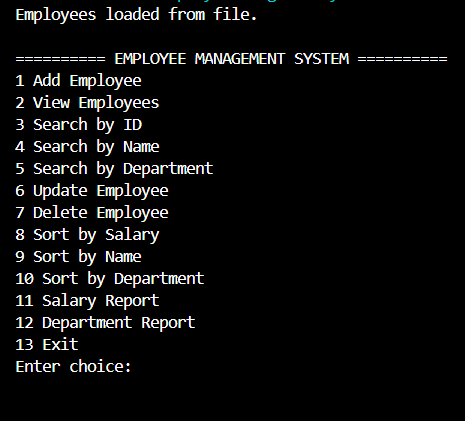

---

# Add Employee
Choose Add Employee from choice as 1 from the menu and enter the required employee details such as ID, Name, Department, Position, and Salary.

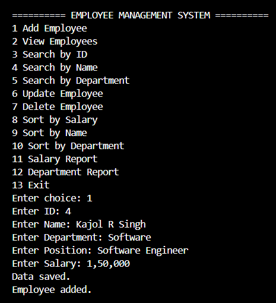

---

# View Employees
Choose View Employees from choice 2 to display all stored employees in a structured table format.

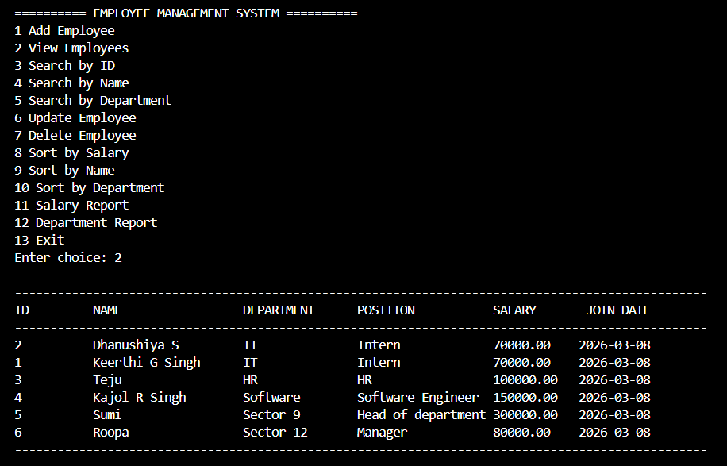

---

# Search Employee by ID
Choose Search by ID from choice 3 and enter the employee ID to retrieve the full details of the employee if present.

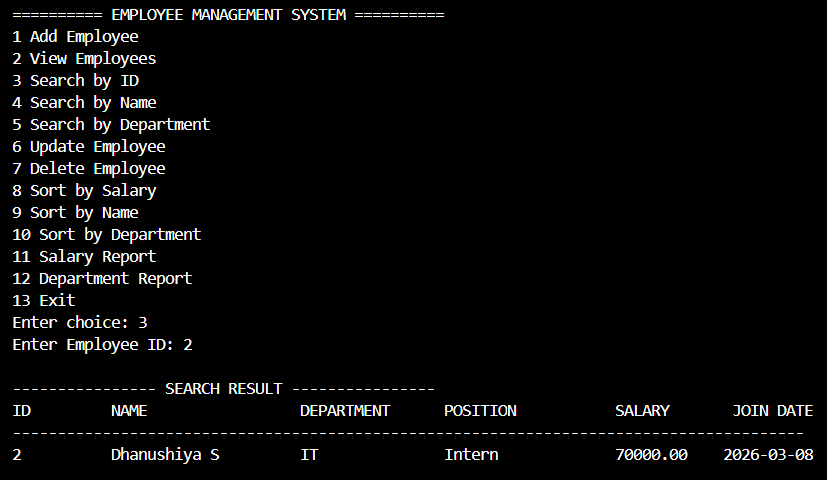

---

# Search Employee by Name
Choose Search by Name from choice 4 and enter the employee name (or part of the name).  
All matching employees will be displayed.

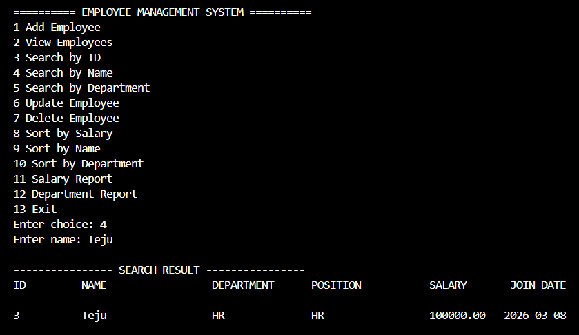

---

# Search Employee by Department
Choose Search by Department from choice 5 and enter the department name.  
All employees belonging to that department will be displayed.

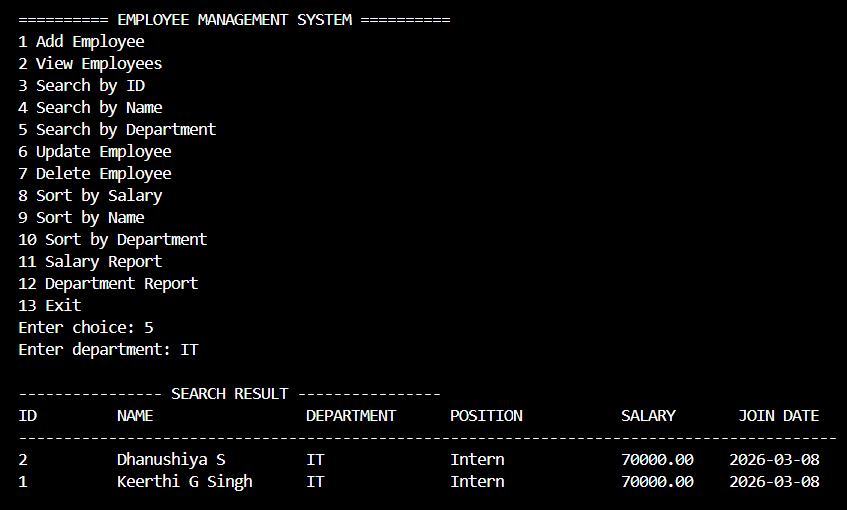

---

# Update Employee
Choose Update Employee from choice 6, enter the employee ID, and update the employee's details.

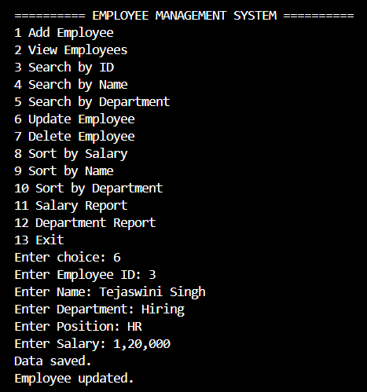

---

# Delete Employee
Choose Delete Employee from choice 7, enter the employee ID, and employee will be deleted .

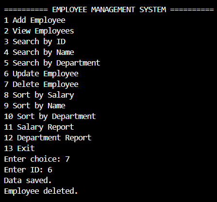

---
# Sorting Employees

## Sort by Salary
Choose choice 8:
Employees can be sorted based on their salary in ascending order.

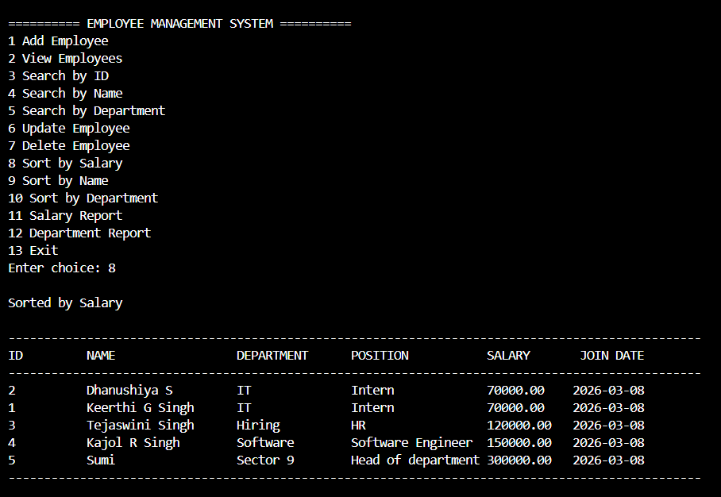

---

## Sort by Name
Choose choice 9:
Employees can be sorted alphabetically by their name.

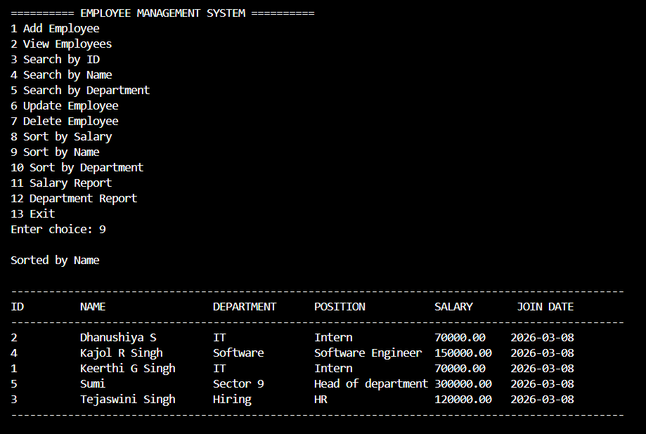

---

## Sort by Department
Choose choice 10:
Employees can be sorted based on their department.

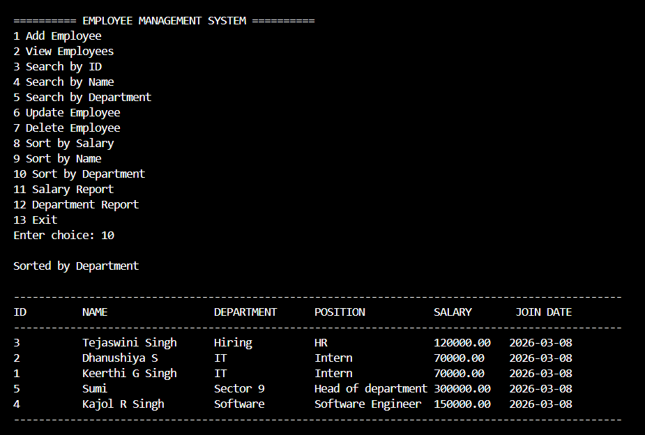

---

# Reports

## Salary Report
Choose choice 11:
Displays salary statistics including:

- Total Employees
- Total Salary
- Average Salary
- Highest Salary (with employee name)
- Lowest Salary (with employee name)

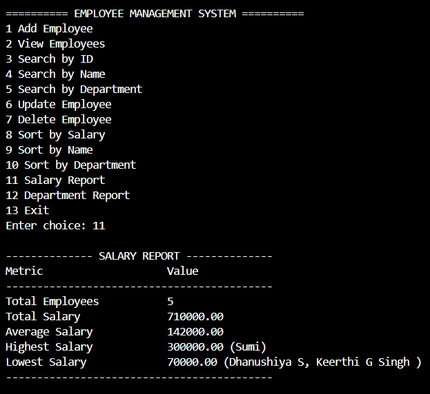

---

## Department Report
Choose choice 12:
Displays department-wise employee statistics including:

- Department Name
- Number of Employees
- Total Salary in each department

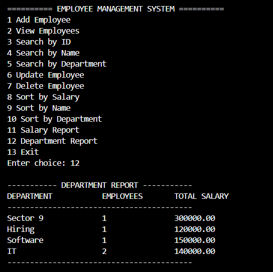

---

# Validation Error Examples

> Salary Validation  
Occurs when an invalid salary value is entered.

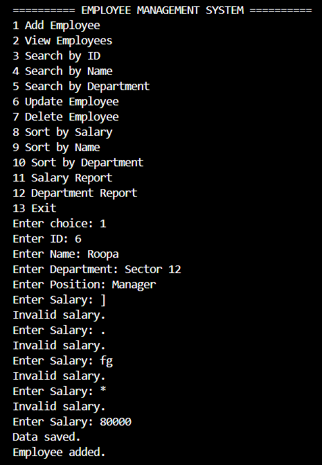

---

> Name Validation  
Occurs when a name contains invalid characters instead of alphabets.

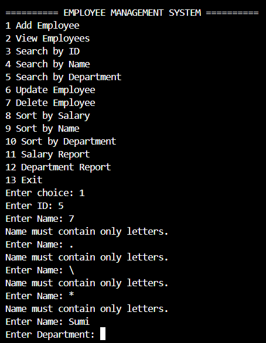

---

> Menu Choice Validation  
Occurs when an invalid menu option is entered.

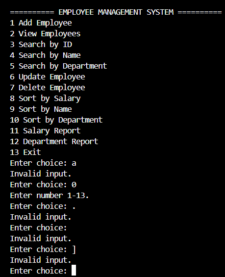

---

# Exit Program
The system allows the user to safely exit the program after completing operations by selecting choice 13.

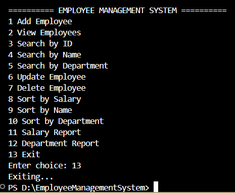

